# Project 4 - Audited Systems

## A Framework for Blue Team Defense

This project is a local system security audit performed on a Windows 11 Pro workstation.

The audit followed a structured vulnerability checklist covering:

* Password and account security
* Software and patch management
* Firewall configuration
* Disk encryption
* Administrative privileges
* Outdated and unsupported software
* System hardening and verification

## Findings

The audit identified:

1. An unencrypted Windows operating-system drive
2. An outdated Java 8 Update 192 installation
3. End-of-life Microsoft Silverlight software

The system was subsequently hardened by enabling BitLocker encryption and removing obsolete software.

## Security Checks

The following PowerShell tools were used during the audit:

```powershell
Get-NetFirewallProfile
Get-BitLockerVolume
Get-LocalGroupMember -Group "Administrators"
Get-ItemProperty HKLM:\Software\Microsoft\Windows\CurrentVersion\Uninstall\*
Get-HotFix
```

## Evidence

The `evidence` directory contains screenshots documenting the initial audit, identified findings, remediation actions, and final hardened state.

---

# 1. Vulnerability Findings

## Finding 1 — BitLocker Encryption Disabled

The operating system drive was found to be fully decrypted.

The audit showed:

- Volume Status: FullyDecrypted
- Encryption Percentage: 0%
- Protection Status: Off

This means data stored on the operating system drive was not protected by full-disk encryption.

### Finding Evidence

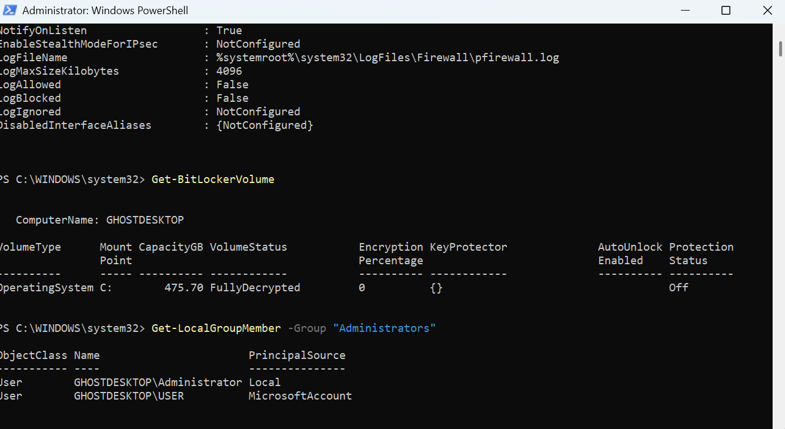

---

## Finding 2 — Outdated Java Installation

Java 8 Update 192 was identified as outdated software during the installed-software audit.

Both the 32-bit and 64-bit Java 8 Update 192 installations were identified and subsequently removed.

### Finding Evidence

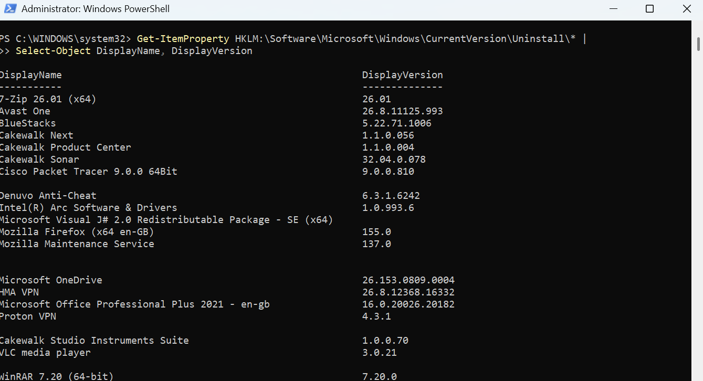

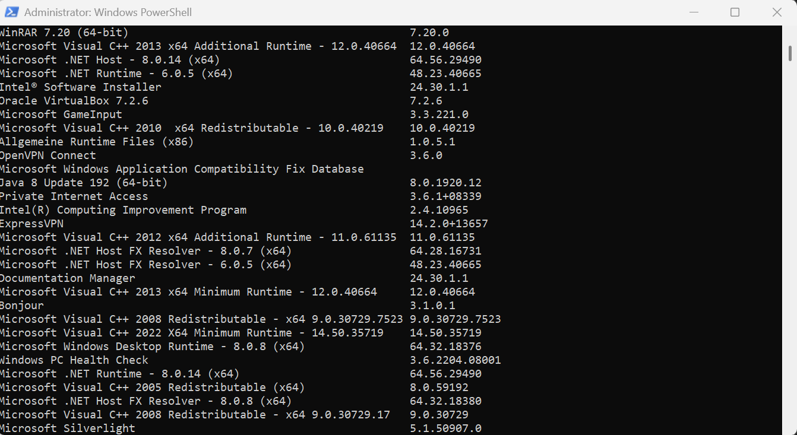


---

## Finding 3 — Microsoft Silverlight

Microsoft Silverlight was identified during the software audit as obsolete/end-of-life software.

The software was addressed as part of the remediation process.

### Finding Evidence


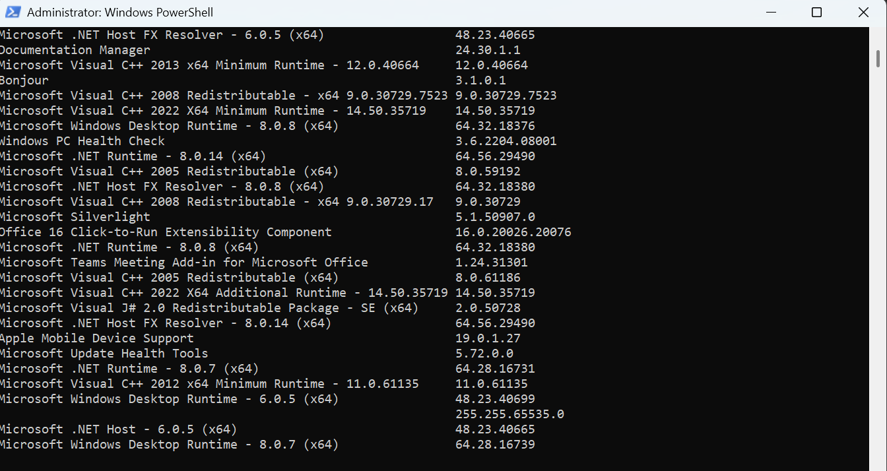

---

# 2. Security Checks That Passed

## Windows Firewall

The Windows Firewall was enabled across the Domain, Private, and Public profiles.

### Firewall Evidence

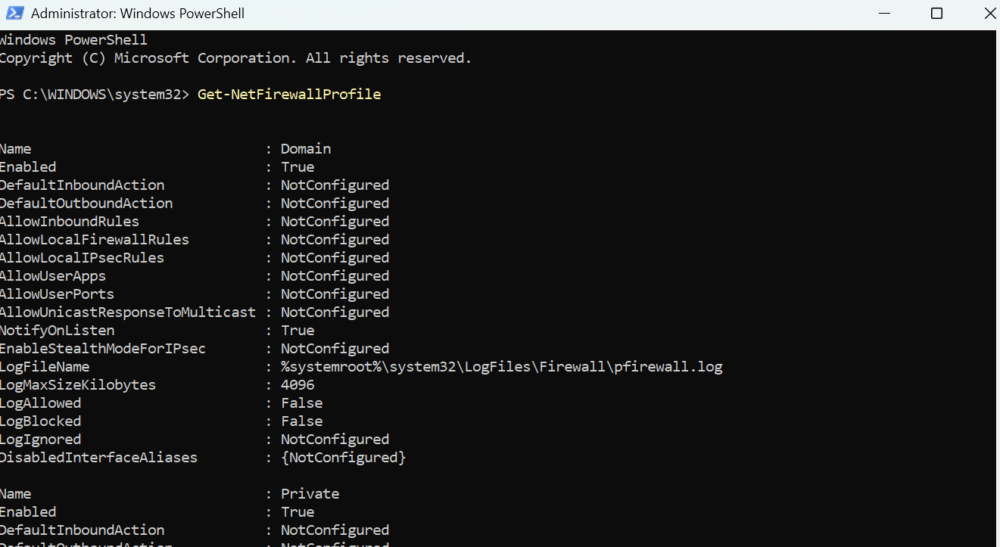

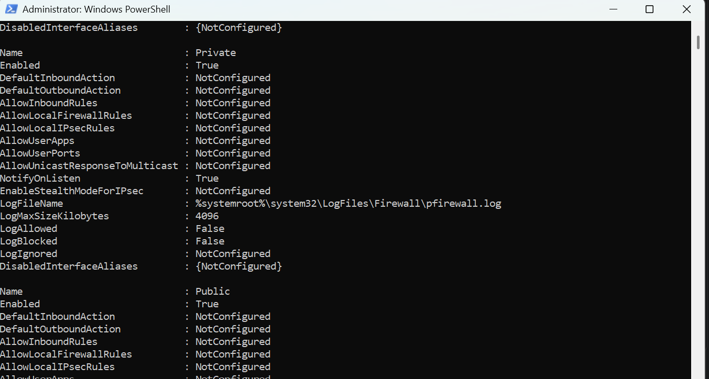

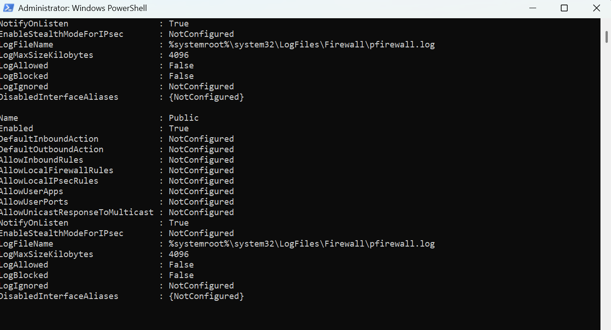

---

## Windows Update

Windows update status was checked using PowerShell and recent security updates were present on the system.

### Update Evidence

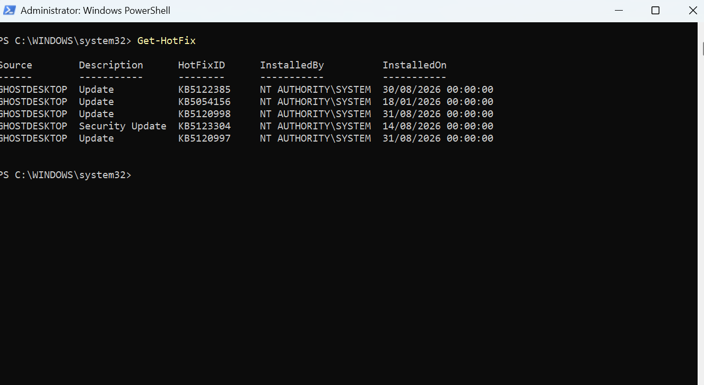

---


# 3. Remediation Actions

## 3.1 Java Removal

The outdated Java 8 Update 192 installations were removed from the system. Post-remediation checks confirmed that Java was no longer installed or available through the command line.

### Remediation Evidence

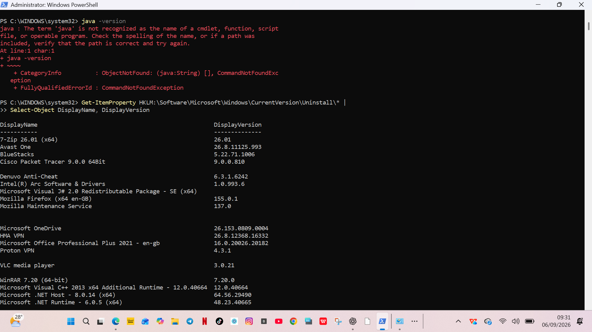

---

## 3.2 Microsoft Silverlight Removal

The obsolete Microsoft Silverlight installation was removed from the system. Registry checks were performed after remediation to verify that no Silverlight installation remained.

### Remediation Evidence

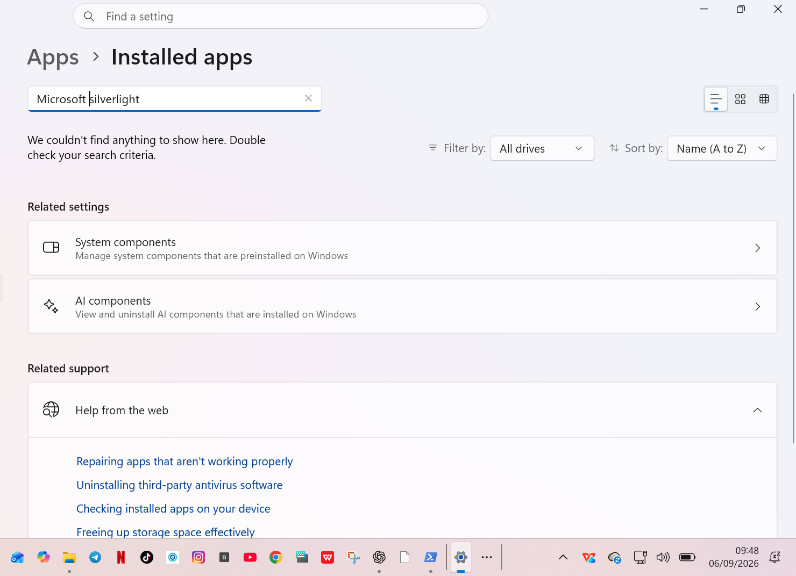

---

## 3.3 BitLocker Encryption

BitLocker encryption was enabled on the Windows operating-system drive to protect data stored on the device.

### Remediation Evidence

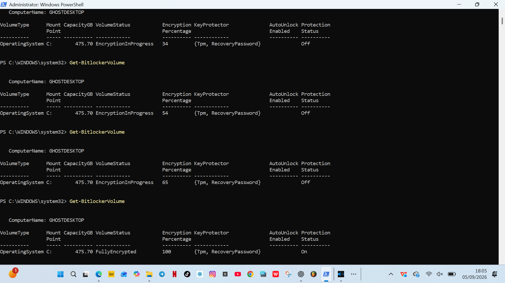

## Skills Demonstrated

* System security auditing
* Vulnerability identification
* Risk assessment
* PowerShell security checks
* Patch and software management
* Disk encryption
* Security remediation
* Verification and documentation

  ## Conclusion

This project demonstrated the process of auditing a Windows system, identifying security weaknesses, applying remediation, and collecting evidence to verify the security posture of the system.

The exercise reinforced the importance of encryption, software lifecycle management, firewall configuration, patch management, and least-privilege principles in defensive cybersecurity.

**Project:** Cybersecurity Project 4
**Type:** Blue Team / Defensive Security Audit

### Alexander Joseph
